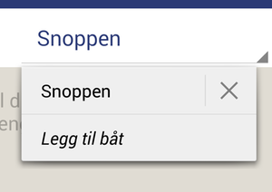
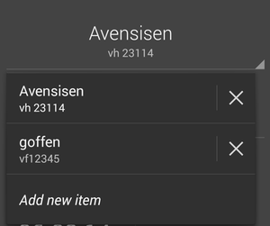

AndroidDynamicSpinner
=====================

```
<dependency>
  <groupId>no.wtw.android</groupId>
  <artifactId>android-dynamic-spinner</artifactId>
  <type>apklib</type>
  <version>xxx</version>
</dependency>
```

## Usage

1. Subclass DynamicSpinner and set the item generic type.  
```MyItemSpinner extends DynamicSpinner<MyItemType>```
1. Subclass DynamicSpinnerAdapter, set generic type (same as above), and override the methods required.  
```MyItemSpinnerAdapter extends DynamicSpinnerAdapter<MyItemType> ```  
The adapter provides custom selected and dropdown views for your items. 
1. Add items to the adapter (standard procedure), and ddd the adapter to the spinner.
1. Set/implement the dynamic spinner listener. This handles clicks on items, delete button and add button.  
```myItemSpinner.setDynamicSpinnerListener(myListener) ```
1. Implement callback required by listener. (onItemDelete, onItemSelected, onItemAdd). 

## Screenshots

 

## Theming

The delete icon in the spinner may be replaced by an icon of your choice. First add a style to your theme:

```
...
<item name="ds_dynamicSpinnerStyle">@style/mySpinnerStyle</item>
...
```

Then add an icon reference in the style you created:

```
<style name="myDynamicSpinnerStyle">
    <item name="ds_deleteItemIcon">@drawable/my_delete_icon</item>
</style>
```

